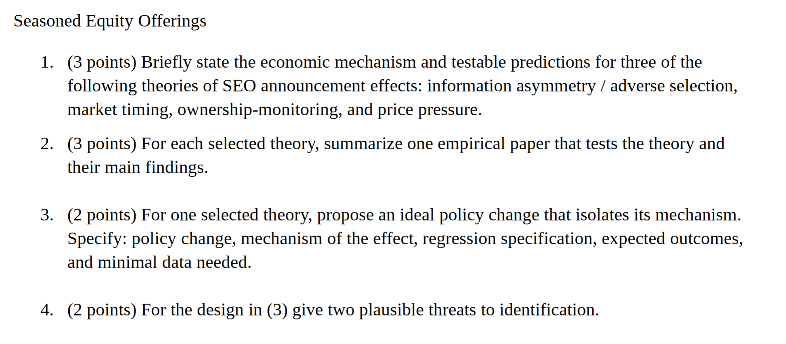

# Corporate Finance Paper Index

## Firm Valuation, Investment, and Financing Decisions

- [ ] Berk and DeMarzo (2011), *Corporate Finance*, Part V, Chapters 14-16. 
- [ ] DeAngelo and Masulis (1980), *Optimal Capital Structure under Corporate and Personal Taxes*, Journal of Financial Economics. 
- [ ] Fama and French (1998), *Taxes, Financing Decisions, and Firm Value*, Journal of Finance. 
- [ ] Graham (2000), *How Big Are the Tax Benefits of Debt?*, Journal of Finance.  
- [ ] Graham and Tucker (2006), *Tax Shelters and Corporate Debt Policy*, Journal of Financial Economics.  
- [ ] Miller (1988), *The Modigliani Miller Propositions after Thirty Years*, Journal of Economic Perspectives.  
- [ ] Miller and Modigliani (1961), *Dividend Policy, Growth, and the Valuation of Shares*, Journal of Business.  
- [ ] Modigliani and Miller (1958), *The Cost of Capital, Corporation Finance, and the Theory of Investment*, American Economic Review.  
- [ ] Modigliani and Miller (1963), *Corporate Income Taxes and the Cost of Capital: A Correction*, American Economic Review. 
- [ ] Smith and Watts (1992), *The Investment Opportunity Set and Corporate Financing, Dividend, and Compensation Policies*, Journal of Financial Economics. 
- [ ] Stein (1996), *Rational Capital Budgeting in an Irrational World*, Journal of Business.  
- [ ] Stulz (1990), *Managerial Discretion and Optimal Financing Policies*, Journal of Financial Economics. 
- [ ] Zingales (2000), *In Search of New Foundations*, Journal of Finance. 
- [ ] Rajan (2012), *The Corporation in Finance*, Journal of Finance. 
- [ ] Ross (1977), *The Determination of Financial Structure: The Incentive Signaling Approach*, Bell Journal of Economics.  
- [ ] Vermaelen (1981), *Common Stock Repurchases and Market Signaling*, Journal of Financial Economics.  
- [ ] Masulis (1980), *The Effect of Capital Structure Change on Security Prices: A Study of Exchange Offers*, Journal of Financial Economics.  
- [ ] Panier, Perez-Gonzalez and Villanueva (2013), *Capital Structure and Taxes*, slides update. 
- [ ] Ma (2019), *Nonfinancial Firms as Cross-Market Arbitrageurs*, Journal of Finance. 

## Financial Distress

- [ ] Pulvino (1998), *Do Asset Fire Sales Exist? An Empirical Investigation of Commercial Aircraft Transactions*, Journal of Finance. 
- [ ] Benmelech (2007), *Asset Salability and Debt Maturity: Evidence from 19th Century American Railroads*, Review of Financial Studies. 
- [ ] Andrade and Kaplan (1998), *How Costly is Financial Distress? Evidence from Highly Leveraged Transactions*, Journal of Finance.  
- [ ] Benmelech, Garmaise and Moskowitz (2005), *Do Liquidation Values Affect Financial Contracts? Evidence from Commercial Loan Contracts and Zoning Regulation*, Quarterly Journal of Economics. 
- [ ] Warner (1977), *Bankruptcy Costs: Some Evidence*, Journal of Finance. 
- [ ] Cutler and Summers (1988), *The Costs of Conflict Resolution and Financial Distress: Evidence from Texaco-Pennzoil Litigation*, RAND Journal of Economics. 
- [ ] Weiss (1990), *Bankruptcy Resolution: Direct Costs and Violation of Priority of Claims*, Journal of Financial Economics.  
- [ ] Hortacsu, Matvos, Syverson and Venkataraman (2011), *Indirect Costs of Financial Distress in Durable Goods Industries: The Case of Auto Manufacturers*, Review of Financial Studies. 
- [ ] Brown and Matsa (2016), financial distress / labor market evidence. 
- [ ] Baghai et al. (2021), financial distress / labor market evidence. 

## Capital Structure Theory

### Foundational Theories

**MM Benchmark and Extensions**
- [ ] Modigliani and Miller (1958), *The Cost of Capital, Corporation Finance, and the Theory of Investment*, American Economic Review.  
  - Mechanism：在完美市场下，企业价值由资产端现金流决定，融资结构只是切分方式，不创造价值。
- [ ] Modigliani and Miller (1963), *Corporate Income Taxes and the Cost of Capital: A Correction*, American Economic Review. 
  - Mechanism：公司税使利息可抵扣，债务创造税盾价值 $V_L=V_U+T_CD$。
- [ ] Miller (1988), *The Modigliani Miller Propositions after Thirty Years*, Journal of Economic Perspectives.  
  - Mechanism：回顾 MM 理论发展，强调投资者自制杠杆（homemade leverage）可复制企业融资决策。

**Tax-Based Theories**
- [ ] DeAngelo and Masulis (1980), *Optimal Capital Structure under Corporate and Personal Taxes*, Journal of Financial Economics. 
  - Mechanism：个人税削弱债务税盾优势，净收益取决于 $(1-T_C)(1-t_{pe})/(1-t_{pd})$。
- [ ] Graham (2000), *How Big Are the Tax Benefits of Debt?*, Journal of Finance.  
  - Mechanism：模拟企业边际税率分布，估算债务税盾价值占企业价值 5-10%；企业实际杠杆低于税收最优水平。
- [ ] Graham and Tucker (2006), *Tax Shelters and Corporate Debt Policy*, Journal of Financial Economics.  
  - Mechanism：税收庇护（tax shelters）可替代债务税盾，使用税收庇护的企业杠杆率更低。
- [ ] Fama and French (1998), *Taxes, Financing Decisions, and Firm Value*, Journal of Finance. 
  - Mechanism：检验税收对融资决策和企业价值的影响。
- [ ] Panier, Perez-Gonzalez and Villanueva (2013), *Capital Structure and Taxes*, slides update. 
  - Mechanism：利用税改自然实验识别税率变化对资本结构的因果影响。

### Agency-Based Theories

**Manager-Shareholder Conflicts**
- [ ] Jensen and Meckling (1976), *Theory of the Firm: Managerial Behavior, Agency Costs and Ownership Structure*, Journal of Financial Economics. 
  - Mechanism：债务约束管理层自由现金流，降低代理成本；股权稀释降低管理层持股比例，增加代理成本。
- [ ] Jensen (1986), *Agency Costs of Free Cash Flow, Corporate Finance, and Takeovers*, American Economic Review.  
  - Mechanism：自由现金流使管理层过度投资或浪费资源；债务承诺派息可约束管理层。
- [ ] Stulz (1990), *Managerial Discretion and Optimal Financing Policies*, Journal of Financial Economics. 
  - Mechanism：最优融资政策平衡债务约束收益与财务困境成本。

**Shareholder-Debtholder Conflicts**
- [ ] Myers (1977), *Determinants of Corporate Borrowing*, Journal of Financial Economics.  
  - Mechanism：现有债务使股东投资 NPV>0 项目时收益部分归债权人，导致投资不足（underinvestment）。
- [ ] Smith and Watts (1992), *The Investment Opportunity Set and Corporate Financing, Dividend, and Compensation Policies*, Journal of Financial Economics. 
  - Mechanism：成长期权多的企业应降低杠杆，避免债务悬置（debt overhang）导致投资不足。

### Information Asymmetry Theories

**Pecking Order Theory**
- [ ] Myers and Majluf (1984), *Corporate Financing and Investment Decisions When Firms Have Information that Investors Do Not Have*, Journal of Financial Economics.  
  - Mechanism：信息不对称下，股权融资被视为高估信号，企业优先使用内部资金、债务，最后才发股。
- [ ] Myers (1984), *The Capital Structure Puzzle*, Journal of Finance. 
  - Mechanism：提出 pecking order theory，解释为何企业不追求目标杠杆率。
- [ ] Myers (2003), *Financing of Corporations*, Handbook of the Economics of Finance. 
  - Mechanism：综述融资理论，对比 pecking order 与 trade-off theory。

**Signaling Theories**
- [ ] Ross (1977), *The Determination of Financial Structure: The Incentive Signaling Approach*, Bell Journal of Economics.  
  - Mechanism：高质量企业通过高杠杆发信号，因破产成本对低质量企业更高（separating equilibrium）。
- [ ] Masulis (1980), *The Effect of Capital Structure Change on Security Prices: A Study of Exchange Offers*, Journal of Financial Economics.  
  - Mechanism：债换股公告正向市场反应，股换债负向反应，支持信号理论。

### Market Timing Theory

- [ ] Baker and Wurgler (2002), *Market Timing and Capital Structure*, Journal of Finance.  
  - Mechanism：企业在股价高时发股、低时回购，资本结构是历次市场时机选择的累积结果。
- [ ] Alti (2006), *How Persistent is the Impact of Market Timing on Capital Structure?*, Journal of Finance. 
  - Mechanism：IPO 时机选择对资本结构的影响在 2 年内消失，不支持长期持续性。
- [ ] Stein (1996), *Rational Capital Budgeting in an Irrational World*, Journal of Business.  
  - Mechanism：理性管理者可利用市场错误定价进行融资和投资决策。

### Trade-Off Theory and Dynamic Models

**Static Trade-Off**
- [ ] Harris and Raviv (1991), *The Theory of Capital Structure*, Journal of Finance. 
  - Mechanism：综述资本结构理论，整合代理、信息不对称、产品市场互动等机制。

**Dynamic Trade-Off**
- [ ] Fischer, Heinkel and Zechner (1989), *Dynamic Recapitalization under Corporate and Personal Taxes*, Journal of Finance. 
  - Mechanism：调整成本使企业在杠杆区间内漂移，触及边界时重新调整（range adjustment）。
- [ ] Kayhan and Titman (2007), *Firms' Histories and Their Capital Structures*, Journal of Financial Economics. 
  - Mechanism：企业历史（盈利、市场估值）影响当前资本结构，但企业逐步向目标杠杆调整。

### Empirical Evidence and Cross-Sectional Determinants

- [ ] Titman and Wessels (1988), *The Determinants of Capital Structure Choice*, Journal of Finance. 
  - Mechanism：用结构方程模型检验资本结构决定因素，发现资产独特性、规模、盈利能力等显著影响杠杆。
- [ ] Rajan and Zingales (1995), *What Do We Know about Capital Structure? Some Evidence from International Data*, Journal of Finance.  
  - Mechanism：G7 国家杠杆率决定因素相似（有形资产+、规模+、盈利-、市值账面比-），支持跨国理论一致性。
- [ ] Frank and Goyal (2007), *Capital Structure Decisions: Which Factors are Reliably Important?*, Financial Management. 
  - Mechanism：系统检验 39 个因素，发现行业杠杆中位数、市值账面比、有形资产、盈利、规模、预期通胀最稳健。
- [ ] Lemmon, Roberts and Zender (2008), *Back to the Beginning: Persistence and the Cross-Section of Corporate Capital Structure*, Journal of Finance. 
  - Mechanism：企业杠杆高度持续，不可观测固定效应解释大部分截面差异，传统因素解释力有限。
- [ ] Fama and French (2002), *Testing Trade-Off and Pecking Order Predictions about Dividends and Debt*, Review of Financial Studies. 
  - Mechanism：盈利能力与杠杆负相关支持 pecking order，但股利政策证据混合。
- [ ] Graham and Leary (2011), *A Review of Capital Structure Research and Directions for the Future*, Annual Review of Financial Economics. 
  - Mechanism：综述资本结构实证研究，指出未来研究方向（动态调整、金融危机、新兴市场等）。

### Broader Perspectives

- [ ] Zingales (2000), *In Search of New Foundations*, Journal of Finance. 
  - Mechanism：呼吁重新审视公司金融理论基础，整合不完全契约、政治经济学等视角。
- [ ] Rajan (2012), *The Corporation in Finance*, Journal of Finance. 
  - Mechanism：探讨公司作为组织形式在金融体系中的角色与演化。
- [ ] Ma (2019), *Nonfinancial Firms as Cross-Market Arbitrageurs*, Journal of Finance. 
  - Mechanism：非金融企业利用跨市场套利机会进行融资决策。

## Corporate Payout Policies

- [ ] Berk and DeMarzo, Chapter 17. 
- [ ] Brav, Graham, Harvey and Michaely (2008), *Managerial Response to the May 2003 Dividend Tax Cut*, Financial Management. 
- [ ] Allen and Michaely (2003), *Payout Policy*, Handbook of Economics of Finance.  
- [ ] DeAngelo, DeAngelo and Skinner (2004), *Are Dividends Disappearing? Dividend Concentration and the Consolidation of Earnings*, Journal of Financial Economics. 
- [ ] DeAngelo, DeAngelo and Stulz (2006), *Dividend Policy and the Earned/Contributed Capital Mix: A Test of the Life-Cycle Theory*, Journal of Financial Economics. 
- [ ] Fama and French (2001), *Disappearing Dividends: Changing Firm Characteristics or Lower Propensity to Pay?*, Journal of Financial Economics. 
- [ ] Farre-Mensa, Michaely and Schmalz (2014), dividend policy review.  
- [ ] Grullon, Michaely and Swaminathan (2002), *Are Dividend Changes a Sign of Firm Maturity?*, Journal of Business. 
- [ ] Hoberg and Prabhala (2009), *Disappearing Dividends, Catering, and Risk*, Review of Financial Studies. 
- [ ] Ikenberry, Lakonishok and Vermaelen (1995), *Market Underreaction to Open Market Share Repurchases*, Journal of Financial Economics.  
- [ ] Jagannathan, Stephens and Weisbach (2000), *Financial Flexibility and the Choice between Dividends and Stock Repurchases*, Journal of Financial Economics. 
- [ ] Jensen (1986), *Agency Costs of Free Cash Flow, Corporate Finance, and Takeovers*, American Economic Review.  
- [ ] La Porta, Lopez-de-Silanes, Shleifer and Vishny (2000), *Agency Problems and Dividend Policies around the World*, Journal of Finance.  
- [ ] Lie (2000), *Excess Funds and Agency Problems: An Empirical Study of Incremental Cash Disbursements*, Review of Financial Studies. 
- [ ] Michaely, Thaler and Womack (1995), *Price Reactions to Dividend Initiations and Omissions: Overreaction or Drift?*, Journal of Finance.  
- [ ] Peyer and Vermaelen (2009), *The Nature and Persistence of Buyback Anomalies*, Review of Financial Studies.  
- [ ] Brennan (1970), dividend taxes. 
- [ ] Litzenberger and Ramaswamy (1979, 1980), dividend taxes / ex-dividend pricing. 
- [ ] Miller and Scholes (1982), dividend taxes. 
- [ ] Elton and Gruber (1970), ex-dividend day prices. 
- [ ] Kalay (1982), ex-dividend day prices. 
- [ ] Lakonishok and Vermaelen (1986), dividend tax clientele / arbitrage trading. 
- [ ] Michaely and Vila (1986), dividend tax clientele / arbitrage trading. 
- [ ] Hietala (1990), dynamic clientele. 
- [ ] Rantapuska (2008), dynamic clientele. 
- [ ] Bhattacharya (1979), dividend signaling. 
- [ ] Aharony and Swary (1980), dividend announcements. 
- [ ] Kumar (1988), dividend policy and information asymmetry. 
- [ ] Guttman, Kadan and Kandel (2010), dividend smoothing / signaling. 
- [ ] Fudenberg and Tirole (1995), dividend smoothing / signaling. 
- [ ] DeMarzo and Sannikov (2011), dynamic signaling / payout. 
- [ ] Acharya and Lambert (2013), payout / signaling. 
- [ ] Almeida, Campello and Weisbach (2004), corporate liquidity / payout context. 
- [ ] Bates, Kahle and Stulz (2009), cash holdings. 
- [ ] Easterbrook (1984), agency explanation of dividends. 
- [ ] Allen, Bernardo and Welch (2000), dividends and institutional investors. 
- [ ] Grullon and Michaely (2012), payout substitution / complementarity. 
- [ ] Officer (2011), payout substitution. 
- [ ] John and Knyazeva (2006), payout substitution. 

## Seasoned Equity Offerings

- [ ] Bayless and Chaplinsky (1991), *Expectations of Security Type and the Information Content of Debt and Equity Offers*, Journal of Financial Intermediation. 
- [ ] Denis (1994), *Investment Opportunities and the Market Reaction to Equity Offerings*, Journal of Financial and Quantitative Analysis. 
- [ ] Eckbo, Masulis and Norli (2007), *Security Offerings*, Handbook of Corporate Finance: Empirical Corporate Finance. 
- [ ] Eckbo and Masulis (1992), *Adverse Selection and the Rights Offer Paradox*, Journal of Financial Economics.  
- [ ] Jung, Kim and Stulz (1996), *Timing, Investment Opportunities, Managerial Discretion, and the Security Issue Decision*, Journal of Financial Economics. 
- [ ] Korajczyk, Lucas and McDonald (1992), *Equity Issues with Time-Varying Asymmetric Information*, Journal of Financial and Quantitative Analysis. 
- [ ] Kothare (1997), *The Effects of Equity Issues on Ownership Structure and Stock Liquidity: A Comparison of Rights and Public Offering*, Journal of Financial Economics.  
- [ ] Wruck (1989), *Equity Ownership Concentration and Firm Value: Evidence from Private Equity Financings*, Journal of Financial Economics.  
- [ ] Fama and French (2005), *Financing Decisions: Who Issues Stock?*, Journal of Financial Economics. 
- [ ] Hertzel, Huson and Parrino (2012), *Public Market Staging: The Timing of Capital Infusions in Newly Public Firms*, Journal of Financial Economics. 
- [ ] Smith (1986), SEO announcement effects. 
- [ ] Asquith and Mullins (1986), issue size / SEO announcement effects. 
- [ ] Masulis and Korwar (1986), management share sales / SEO announcement effects. 
- [ ] Hansen (1989), rights issue renouncements and bad signals. 
- [ ] Choe, Masulis and Nanda (1993), macro conditions / business cycle and SEO announcement effects. 
- [ ] Bayless and Chaplinsky (1996), hot versus cold markets and SEO announcement effects. 
- [ ] Holderness and Pontiff (2016), rights offers / shareholder participation. 
- [ ] Scholes (1972), price pressure hypothesis. 
- [ ] Miller and Rock (1985), implied cash flow hypothesis. 
- [ ] Loughran and Ritter (1995), long-run underperformance after SEO. 
- [ ] Spiess and Affleck-Graves (1995), long-run underperformance after SEO. 
- [ ] Fu (2014), long-run SEO abnormal returns. 

## Information Asymmetry, Adverse Selection, and Signaling

**Foundational Asymmetric Information Theory**
- [ ] Akerlof (1970), *The Market for Lemons: Quality Uncertainty and the Market Mechanism*, Quarterly Journal of Economics.  
  - Mechanism：信息不对称导致逆向选择，低质量产品驱逐高质量产品，市场可能崩溃。
- [ ] Spence (1973), *Job Market Signaling*, Quarterly Journal of Economics.  
  - Mechanism：高质量类型通过成本差异化信号（如教育）实现分离均衡。
- [ ] Stiglitz (1969), *A Re-Examination of the Modigliani-Miller Theorem*, American Economic Review. 
  - Mechanism：在完全市场和无摩擦下，企业金融政策只改变 claims 分割，不改变 real allocation。
- [ ] Stiglitz and Weiss (1981), *Credit Rationing in Markets with Imperfect Information*, American Economic Review. 
  - Mechanism：信息不对称导致银行通过信贷配给而非价格清市场。

**Financing under Asymmetric Information**
- [ ] Daniel and Titman (1995), *Financing Investment under Asymmetric Information*, Handbooks in Operational Research and Management Science. 
  - Mechanism：综述信息不对称下的融资决策理论。
- [ ] Miller and Rock (1985), *Dividend Policy under Asymmetric Information*, Journal of Finance.  
  - Mechanism：派息量揭示当前现金流信息；外部融资需求越高，市场越推断现金流低于预期。
- [ ] John and Williams (1985), *Dividends, Dilution and Taxes*, Journal of Finance. 
  - Mechanism：派息作为信号，考虑稀释效应和税收成本。

**Signaling Cost Types**
- [ ] Ross (1977), *The Determination of Financial Structure: The Incentive Signaling Approach*, Bell Journal of Economics.   
  - Mechanism：高质量企业通过高杠杆发信号，破产成本对低质量企业更高（dissipative cost）。
- [ ] Vermaelen (1981), *Common Stock Repurchases and Market Signaling*, Journal of Financial Economics.   
  - Mechanism：回购溢价主要是财富转移（non-dissipative），向留存股东传递低估信号。
- [ ] Vermaelen (1984), *Repurchase Tender Offers, Signaling, and Managerial Incentives*, Journal of Financial and Quantitative Analysis. 
  - Mechanism：补充 Vermaelen (1981)，分析 tender offer 的信号机制与管理层激励。

## Econometric and Identification References in Slides

- [ ] Petersen (2008), standard errors / panel data in finance. 
- [ ] Gormley and Matsa (2014), critique / fixed effects and empirical design. 
- [ ] Angrist, Imbens and Rubin (1996), IV identifies LATE. 
- [ ] Erickson and Whited (2000), measurement error correction. 
- [ ] Gross et al. (2021), empirical design reference. 
- [ ] Ewens et al. (2024), empirical design reference. 
- [ ] Bound, Jaeger and Baker (1995), weak instruments / IV. 

## Optimal Dynamic Financial Contracting

- [ ] Holmström and Tirole (1997), *Financial Intermediation, Loanable Funds, and the Real Sector*, Quarterly Journal of Economics.  
- [ ] Innes (1990), *Limited Liability and Incentive Contracting with Ex-Ante Action Choices*, Journal of Economic Theory.  
- [ ] Laffont and Martimort (2009), *The Theory of Incentives: The Principal-Agent Model*, Princeton University Press. 
- [ ] Bolton and Scharfstein (1990), *A Theory of Predation Based on Agency Problems in Financial Contracting*, American Economic Review.  
- [ ] Rogerson (1985), *Repeated Moral Hazard*, Econometrica. 
- [ ] Spear and Srivastava (1987), *On Repeated Moral Hazard with Discounting*, Review of Economic Studies. 
- [ ] Biais, Mariotti, Plantin and Rochet (2007), *Dynamic Security Design: Convergence to Continuous Time and Asset Pricing Implications*, Review of Economic Studies.  
- [ ] Clementi and Hopenhayn (2006), *A Theory of Financing Constraints and Firm Dynamics*, Quarterly Journal of Economics. 
- DeMarzo and Fishman (2007a), *Agency and Optimal Investment Dynamics*, Review of Financial Studies. 
- DeMarzo and Fishman (2007b), *Optimal Long-Term Financial Contracting*, Review of Financial Studies. 
- [ ] DeMarzo and Sannikov (2006), *Optimal Security Design and Dynamic Capital Structure in a Continuous-Time Agency Model*, Journal of Finance.  
- [ ] Biais, Mariotti, Rochet and Villeneuve (2010), *Large Risks, Limited Liability and Dynamic Moral Hazard*, Econometrica.  
- [ ] DeMarzo, Fishman, He and Wang (2012), *Dynamic Agency and the q Theory of Investment*, Journal of Finance.  
- [ ] He (2009), *Optimal Executive Compensation when Firm Size Follows Geometric Brownian Motion*, Review of Financial Studies.  
- [ ] He (2011), *A Model of Dynamic Compensation and Capital Structure*, Journal of Financial Economics.  
- [ ] Zhu (2013), *Optimal Contracts with Shirking*, Review of Economic Studies.  

## Optimal Dynamic Capital Structure

- [ ] Dixit and Pindyck (1994), *Investment under Uncertainty*, Princeton University Press. 
- [ ] Boyle and Guthrie (2003), *Investment, Uncertainty, and Liquidity*, Journal of Finance. 
- [ ] Merton (1974), *On the Pricing of Corporate Debt: The Risk Structure of Interest Rates*, Journal of Finance. 
- [ ] Leland (1994), *Corporate Debt Value, Bond Covenants, and Optimal Capital Structure*, Journal of Finance.  
- [ ] Diamond and He (2014), *A Theory of Debt Maturity: The Long and Short of Debt Overhang*, Journal of Finance. 
- [ ] Goldstein, Ju and Leland (2001), *An EBIT-Based Model of Dynamic Capital Structure*, Journal of Business. 
- [ ] Hackbarth, Miao and Morellec (2006), *Capital Structure, Credit Risk, and Macroeconomic Conditions*, Journal of Financial Economics.  
- [ ] Leland and Toft (1996), *Optimal Capital Structure, Endogenous Bankruptcy, and the Term Structure of Credit Spreads*, Journal of Finance. 
- [ ] Leland (1998), *Agency Costs, Risk Management, and Capital Structure*, Journal of Finance. 
- [ ] Mella-Barral and Perraudin (1997), *Strategic Debt Service*, Journal of Finance. 
- [ ] Admati, DeMarzo, Hellwig and Pfleiderer (2018), *The Leverage Ratchet Effect*, Journal of Finance.  
- [ ] Benzoni, Garlappi, Goldstein and Ying (2022), *Debt Dynamics with Fixed Issuance Costs*, Journal of Financial Economics. 
- [ ] Bizer and DeMarzo (1992), *Sequential Banking*, Journal of Political Economy.  
- [ ] Coase (1972), *Durability and Monopoly*, Journal of Law and Economics. 
- [ ] DeMarzo (2019), *Presidential Address: Collateral and Commitment*, Journal of Finance. 
- [ ] DeMarzo and He (2021), *Leverage Dynamics without Commitment*, Journal of Finance.  
- [ ] DeMarzo, He and Tourre (2023), *Sovereign Debt Ratchets and Welfare Destruction*, Journal of Political Economy. 
- [ ] DeMarzo and Urosevic (2006), *Ownership Dynamics and Asset Pricing with a Large Shareholder*, Journal of Political Economy. 
- [ ] Donaldson, Gromb and Piacentino (2020), *The Paradox of Pledgeability*, Journal of Financial Economics. 
- [ ] Hu, Varas and Ying (2021), *Debt Maturity Management*, Working Paper. 
- [ ] Malenko and Malenko (2015), *A Theory of LBO Activity Based on Repeated Debt-Equity Conflicts*, Journal of Financial Economics. 
- [ ] Malenko and Tsoy (2023), *Optimal Time-Consistent Debt Policies*, Working Paper. 
- [ ] Bustamante (2009), dynamic capital structure reference. 
- [ ] Strebulaev and Whited (2012), dynamic capital structure reference. 

## Labor and Corporate Finance

- [ ] Matsa (2018), *Capital Structure and a Firm's Workforce*, Annual Review of Financial Economics. 
- [ ] Nishesh, Ouimet and Simintzi (2024), *Labor and Corporate Finance*, Handbook of Corporate Finance. 
- [ ] Curtis, Garrett, Ohrn, Roberts and Suarez-Serrato (2023), *Capital Investment and Labor Demand: Evidence from 21st Century Stimulus Policy*, Working Paper.  
- [ ] Gustafson and Kotter (2023), *Higher Minimum Wages Reduce Capital Expenditures*, Management Science.  
- [ ] Dai and Qiu (2024), *Minimum Wage Hikes and Technology Adoption: Evidence from US Establishments*, Journal of Financial and Quantitative Analysis.  
- [ ] Ouimet, Simintzi and Ye (2025), *The Impact of the Opioid Crisis on Firm Value and Investment*, Review of Financial Studies.  
- Chen, Hshieh and Zhang (2024/2025), *Hiring High-Skilled Labor through Mergers and Acquisitions*, Journal of Financial and Quantitative Analysis.  
- [ ] Beaumont, Hebert and Lyonnet (2025), *Build or Buy? Human Capital and Corporate Diversification*, Review of Financial Studies.  
- [ ] Acharya, Baghai and Subramanian (2014), *Wrongful Discharge Laws and Innovation*, Review of Financial Studies. 
- [ ] Bena, Ortiz-Molina and Simintzi (2022), *Shielding Firm Value: Employment Protection and Process Innovation*, Journal of Financial Economics. 
- [ ] Matsa (2010), *Capital Structure as a Strategic Variable: Evidence from Collective Bargaining*, Journal of Finance.  
- [ ] Simintzi, Vig and Volpin (2015), *Labor Protection and Leverage*, Review of Financial Studies.  
- [ ] Serfling (2016), *Firing Costs and Capital Structure Decisions*, Journal of Finance.  
- [ ] Klasa, Ortiz-Molina, Serfling and Srinivasan (2018), *Protection of Trade Secrets and Capital Structure Decisions*, Journal of Financial Economics. 
- [ ] Jeffers (2024), *The Impact of Restricting Labor Mobility on Corporate Investment and Entrepreneurship*, Review of Financial Studies.  
- [ ] Xu (2025), *Skilled Labor Uncertainty and Corporate Investment: Evidence from H-1B Visa Lottery Cycles*, Management Science. 
- [ ] Agrawal and Matsa (2013), *Labor Unemployment Risk and Corporate Financing Decisions*, Journal of Financial Economics.  
- [ ] Bai, Fairhurst and Serfling (2020), *Employment Protection, Investment, and Firm Growth*, Review of Financial Studies. 
- [ ] Bradley, Kim and Tian (2017), *Do Unions Affect Innovation?*, Management Science. 
- [ ] Campello, Gao, Qiu and Zhang (2018), *Bankruptcy and the Cost of Organized Labor: Evidence from Union Elections*, Review of Financial Studies. 
- [ ] Chen, Harford and Kamara (2019), *Operating Leverage, Profitability, and Capital Structure*, Journal of Financial and Quantitative Analysis. 
- [ ] Ghaly, Dang and Stathopoulos (2017), *Cash Holdings and Labor Heterogeneity: The Role of Skilled Labor*, Review of Financial Studies. 
- [ ] Guernsey, Serfling and Yan (2025), *Marijuana Legalization and Firms' Cost of Equity*, Journal of Financial and Quantitative Analysis. 
- [ ] Hacamo and Kleiner (2022), *Forced Entrepreneurs*, Journal of Finance. 
- [ ] Lee, Mauer and Xu (2018), *Human Capital Relatedness and Mergers and Acquisitions*, Journal of Financial Economics. 
- [ ] Shen (2021), *Skilled Labor Mobility and Firm Value: Evidence from Green Card Allocations*, Review of Financial Studies. 
- [ ] Stanfield and Tumarkin (2018), *Does the Political Power of Nonfinancial Stakeholders Affect Firm Values? Evidence from Labor Unions*, Journal of Financial and Quantitative Analysis. 
- [ ] Tuzel and Zhang (2021), *Economic Stimulus at the Expense of Routine-Task Jobs*, Journal of Finance.  
- [ ] Falato and Liang (2016), labor investment. 
- [ ] Ersahin, Irani and Le (2021), labor reallocation / creditor control rights. 
- [ ] Bai, Eldemire and Serfling (2024), labor / employment protection. 

## ESG, Climate, AI, and Labor Welfare

- [ ] Cohn, Nestoriak and Wardlaw (2021), *Private Equity Buyouts and Workplace Safety*, Review of Financial Studies. 
- [ ] Caskey and Ozel (2017), *Earnings Expectations and Employee Safety*, Journal of Accounting and Economics.  
- [ ] Huang, Li and Zhou (2025), *Substitution Between Corporate Social Responsibility Activities: Evidence from Hiring and Mistreating Unauthorized Workers and Pollution*, Management Science.  
- [ ] Briscoe-Tran (2023), *Are Firms Sacrificing Flexibility for Diversity and Inclusion?*, Working Paper. 
- Briscoe-Tran (2024/2025), *Do Employees Have Useful Information about Firms' ESG Practices?*, Working Paper.  
- [ ] Darendeli, Law and Shen (2022), *Green New Hiring*, Review of Accounting Studies.  
- [ ] Addoum, Ng and Ortiz-Bobea (2023), *Temperature Shocks and Industry Earnings News*, Journal of Financial Economics. 
- Acharya, Bhardwaj and Tomunen (2023/2024), *Do Firms Mitigate Climate Impact on Employment? Evidence from US Heat Shocks*, NBER Working Paper.  
- [ ] Graff Zivin and Neidell (2014), *Temperature and the Allocation of Time: Implications for Climate Change*, Journal of Labor Economics. 
- [ ] Lai, Qiu, Tang, Xi and Zhang (2023), *The Effects of Temperature on Labor Productivity*, Annual Review of Resource Economics. 
- [ ] Pankratz and Schiller (2024), *Climate Change and Adaptation in Global Supply-Chain Networks*, Review of Financial Studies.  
- [ ] Somanathan, Somanathan, Sudarshan and Tewari (2021), *The Impact of Temperature on Productivity and Labor Supply: Evidence from Indian Manufacturing*, Journal of Political Economy. 
- [ ] Adams, Fang, Liu and Wang (2025), *The Rise of AI Pricing: Trends, Driving Forces, and Implications for Firm Performance*, Journal of Monetary Economics. 
- [ ] Babina, Fedyk, He and Hodson (2024), *Artificial Intelligence, Firm Growth, and Product Innovation*, Journal of Financial Economics. 
- [ ] Eisfeldt, Schubert and Zhang (2025), *Generative AI and Firm Values*, Journal of Finance forthcoming. 
- [ ] Kogan, Papanikolaou, Schmidt and Seegmiller (2023), *Technology and Labor Displacement: Evidence from Linking Patents with Worker-Level Data*, NBER Working Paper. 
- [ ] Acemoglu and Restrepo (2018), *Artificial Intelligence, Automation, and Work*, University of Chicago Press volume. 
- [ ] Brynjolfsson, Korinek and Agrawal (2024), *The Economics of Transformative AI: A Research Agenda*, Working Paper. 
- [ ] Brynjolfsson, Li and Raymond (2025), *Generative AI at Work*, Quarterly Journal of Economics. 
- [ ] Chen (2022), *Green Investors and Green Transition Efforts: Talk the Talk or Walk the Walk?*, Working Paper.  
- Effah, Qi and Zhang (2024/2025), *The Unseen Cost of Green Policies: The Impact of Environmental Regulation on Workplace Safety*, Working Paper.  
- [ ] Edmans (2023), *The End of ESG*, Financial Management. 
- [ ] Edmans, Flammer and Glossner (2023), *Diversity, Equity, and Inclusion*, NBER Working Paper. 
- [ ] Fankhauser (2017), *Adaptation to Climate Change*, Annual Review of Resource Economics. 
- [ ] Gornall, Gredil, Howell, Liu and Sockin (2025), *Do Employees Cheer for Private Equity? The Heterogeneous Effects of Buyouts on Job Quality*, Management Science. 
- [ ] Park, Pankratz and Behrer (2021), *Temperature, Workplace Safety, and Labor Market Inequality*, Working Paper. 
- [ ] Pankratz, Bauer and Derwall (2023), *Climate Change, Firm Performance, and Investor Surprises*, Management Science. 
- Xiao (2021/2024/2025), heat risk, labor productivity, capital deepening, firm entry.  
- [ ] Ponticelli, Xu and Zeume (2024), heat risk and energy costs. 
- [ ] Ortiz-Molina, Xiao and Zheng (2023), heat illness prevention standards. 

## Corporate Loans, Liquidity Management, and Real Impact

- [ ] Bharath, Dahiya, Saunders and Srinivasan (2011), *Lending Relationships and Loan Contract Terms*, Review of Financial Studies. 
- [ ] Blickle, Fleckenstein, Hillenbrand and Saunders (2020), *Do Lead Arrangers Retain Their Lead Share?*, Journal of Finance forthcoming. 
- [ ] Blickle, Parlatore and Saunders (2023), *Specialization in Banking*, Journal of Finance forthcoming. 
- [ ] Jiang, Li and Shao (2010), *When Shareholders are Creditors: Effects of the Simultaneous Holding of Equity and Debt by Non-Commercial Banking Institutions*, Review of Financial Studies.  
- [ ] Sufi (2009), *Bank Lines of Credit in Corporate Finance: An Empirical Analysis*, Review of Financial Studies. 
- Bellon (2021/2025), *Fresh Start or Fresh Water: The Impact of Environmental Lender Liability*, Working Paper.  
- [ ] Chava and Roberts (2008), *How Does Financing Impact Investment? The Role of Debt Covenants*, Journal of Finance.  
- [ ] Choy, Jiang, Liao and Wang (2024), *Public Environmental Enforcement and Private Lender Monitoring: Evidence from Environmental Covenants*, Journal of Accounting and Economics.  
- [ ] Chen (2025), *Redeploying Dirty Assets: The Impact of Environmental...*, Journal of Financial Economics.  
- [ ] Bharath, Dahiya, Saunders and Srinivasan (2007), *So What Do I Get? The Bank's View of Lending Relationships*, Journal of Financial Economics. 
- [ ] Chu, Lin and Xiao (2024), *Agree to Disagree: Lender Equity Holdings, Within-Syndicate Conflicts, and Covenant Design*, Journal of Financial Intermediation.  
- [ ] Chu, Xiao and Zheng (2025), *The Industry Expertise Channel of Mortgage Lending*, Journal of Financial and Quantitative Analysis. 
- [ ] Demiroglu and James (2010), *The Information Content of Bank Loan Covenants*, Review of Financial Studies.  
- [ ] Ersahin, Irani and Le (2021), *Creditor Control Rights and Resource Allocation within Firms*, Journal of Financial Economics.  
- [ ] Jimenez, Lopez and Saurina (2009), *Empirical Analysis of Corporate Credit Lines*, Review of Financial Studies. 
- [ ] Chu (2018), *Shareholder-Creditor Conflict and Payout Policy*, Review of Financial Studies. 
- [ ] Chava, Wang and Zou (2019), *Covenants, Creditors' Simultaneous Equity Holdings, and Firm Investment Policies*, Journal of Financial Economics. 
- [ ] Anton and Lin (2020), *The Mutual Friend: Dual Holder Monitoring and Firm Investment Efficiency*, Review of Corporate Finance Studies. 
- [ ] Chu, Diep-Nguyen, Wang, Wang and Wang (2025), dual holding / corporate finance, Review of Corporate Finance Studies. 
- [ ] Chu, Lin, Saffi and Sturgess (2025), *Shareholder-Creditor Conflicts and Equity Lending*, Working Paper. 
- Nini, Smith and Sufi (2009/2012), creditor control rights / covenants and governance. 
