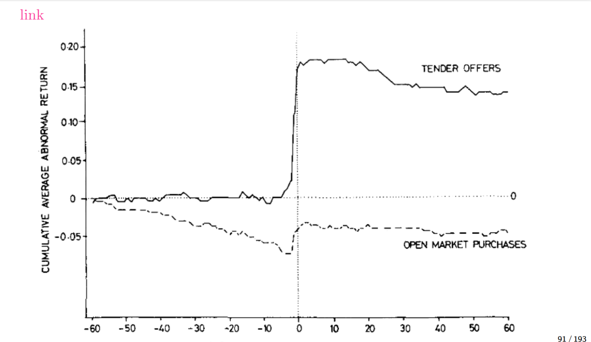
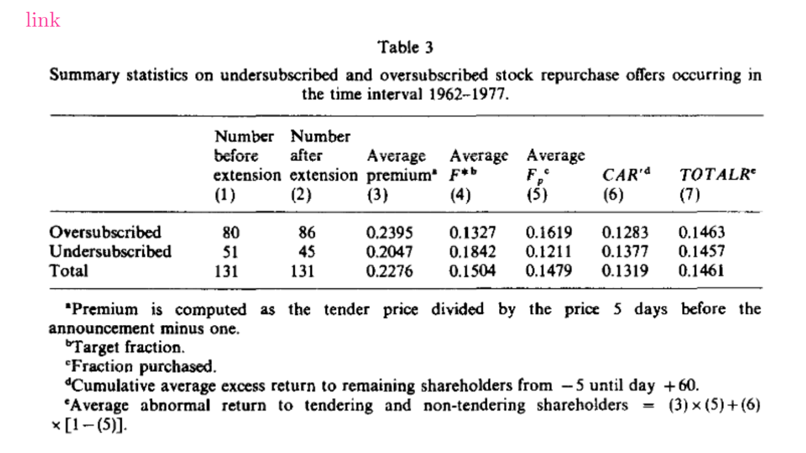

# Vermaelen (1981) - Buybacks

导航：[Corporate Finance index](../index.md)

这张卡对应 [Supporting evidence: Vermaelen (1981) and buybacks](../01_Empirical_Corporate_Finance.md#sec-vermaelen-1981-buybacks). 这里先留双链和结构，后面再补图。

(card-vermaelen-1981-buybacks)=

## Buybacks

Vermaelen studies buybacks as another capital structure change event.

:::{admonition} Note
Buyback map

$$
\begin{aligned}
\text{buybacks}
&\Longrightarrow
\left\{
\begin{aligned}
\text{fixed-price tender offers} &:\ \text{one-shot, explicit price, shareholder tenders or not} \\
\text{open market repurchases} &:\ \text{gradual, flexible, broker buys over time}
\end{aligned}
\right. \\
\text{repurchase}
&\Longrightarrow \text{reduce outstanding claims} \\
\text{claim conversion}
&\Longrightarrow \text{swap one claim for another} \\
\text{value creation}
&\Longrightarrow \text{tax savings + signaling + agency reduction}
\end{aligned}
$$
- `fixed-price tender offer` 是明确要约：公司给定回购价，股东决定是否 tender
- `open market repurchase` 是渐进式回购：公司通过 broker 在市场上分批买，保留灵活性
- `repurchase` 关注减少 outstanding claims；`claim conversion` 关注把一种 claim 换成另一种 claim
- buyback 与 exchange offer 的核心差别是一个偏回购，一个偏转换
- Vermaelen (1981) 和 Masulis (1980) 的事件研究重点不同：前者看 repurchase，后者看 conversion；buyback 这里更关心的是不同 offer 形式对应的 signal 强弱差异，而不是把所有 effect 混在一起。

:::

## Hypotheses and tests

这篇文章不是单一检验，而是围绕四个 hypothesis 看 buyback 的公告反应和后续回报能否区分不同 signal 强度和机制。

1. **Signaling**
   - test：repurchase announcement 是否带来正的短期 $CAR$，以及更强的 tender-offer terms 是否对应更强反应。
   - variables：repurchase premium、repurchased fraction、insider incentives / insider tendering。
   - takeaway：更 costly 的 signal 更可信，因此反应更强。

2. **Leverage hypothesis**
   - test：buyback 是否通过提高 leverage 带来 tax shield / capital structure adjustment。
   - variables：pre-buyback leverage、target leverage、repurchase size。
   - takeaway：如果公司原本 leverage below target，buyback 更可能被市场正面解读。

3. **Bondholder expropriation**
   - test：当 buyback 增加 leverage 时，是否存在债权人受损、股东获益的财富转移。
   - variables：debt risk、claim priority、bondholder loss sensitivity。
   - takeaway：若债务更 risky，回购会更可能被看作对 debtholders 的 expropriation。

4. **Agency costs**
   - test：buyback 是否通过减少 free cash flow 和 manager discretion 提升 value。
   - variables：free cash flow、investment opportunities、ownership / governance proxy。
   - takeaway：当 firm 有 excess cash 但缺少好项目时，buyback 更像 agency-reducing payout。

## Follow-up evidence: Ikenberry, Lakonishok and Vermaelen (1995)

Ikenberry et al. 把 open market repurchase 当成更适合检验 market underreaction 的 setting。

- test object：open market repurchases 后的 long-run performance 是否支持 market underreaction，以及这种反应是否集中在更可能 undervalued 的 firms。
- finding：
  - summary statistics：repurchase firms 后续 long-run abnormal returns 偏高。
  - empirical results：value firms 的 post-buyback performance 更强，说明公告期价格没有完全吸收 undervaluation information。
- interpretation：open-market repurchase 不只是在做 payout；它还可能传递 undervaluation signal，而长期 `BHAR` 比短期 `CAR` 更能检验市场是否 underreact。

## Table 3 interpretation

`oversubscribed` 指 tender / repurchase 申请的股份数量 **超过** 公司计划买回的数量，说明 demand > supply。  
`undersubscribed` 指 tender / repurchase 申请的股份数量 **少于** 公司计划买回的数量，说明 demand < supply。

$$
\begin{aligned}
\text{oversubscribed}
&\Longrightarrow
\text{signal stronger}
\Longrightarrow
\text{higher premium / more attractive repurchase price}
\\
\text{undersubscribed}
&\Longrightarrow
\text{signal weaker}
\Longrightarrow
\text{lower premium / less attractive repurchase price}
\\
CAR &\approx TOTALR
\end{aligned}
$$

- oversubscribed 和 undersubscribed 的差别首先体现在 signal 强弱，而不是先把它们单独当成一组结果。
- oversubscribed 往往对应更强的 signal 和更高的 premium，也就是更有吸引力的回购价。
- undersubscribed 往往对应更弱的 signal 和更低的 premium，也就是回购价吸引力较弱。
- 这张表的核心结论不是“哪一类一定更好”，而是：
  - 两类 offers 都有正向市场反应；
  - `CAR` 和 `TOTALR` 很接近，说明总体回报差异不大；
  - oversubscribed 组的 premium、repurchase intensity 和 signal credibility 往往更强；
  - 真正更重要的是 `signal -> premium -> reaction` 这条链，而不是 oversubscribed / undersubscribed 的标签本身。

## Future insertions

- fixed-price tender offers
- open market repurchases
- repurchase vs claim conversion
- stock return event studies
- earnings event studies
