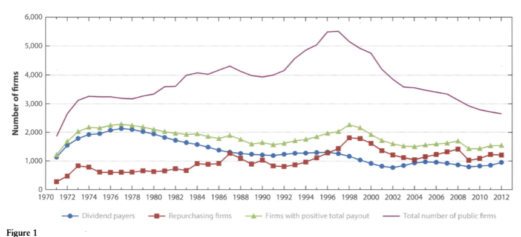
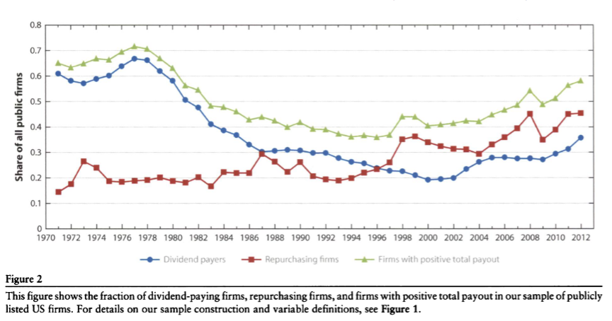
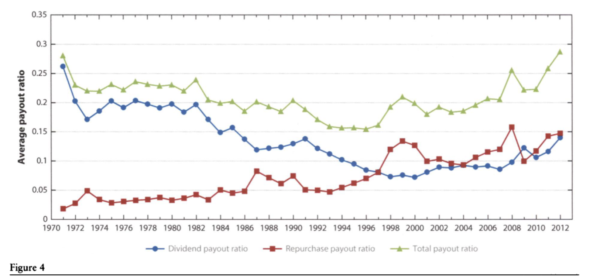

# Reading Note: Farre-Mensa, Michaely and Schmalz (2014)

[Back to the main note](../01_Empirical_Corporate_Finance.md#sec-farre-mensa-2014)

## 1. Core Question
This review asks what the main empirical determinants of dividend policy are, and how much of payout behavior can be explained by investor demand, taxes, agency frictions, signaling, and lifecycle effects.

## 2. Main Channels
- investor demand
- taxes
- agency
- signaling
- lifecycle

## 3. Reading Frame
- The review is useful as a map of payout determinants rather than a single clean identification exercise.
- Dividends and repurchases should be read together when the goal is to understand payout policy.
- The card is intentionally left open for figures and slide screenshots.

## 4. Figure Slots

## 5. Notes
- Add any figures from the review or the lecture slides here.
- Keep the main note concise; use this card for images and longer annotations.
