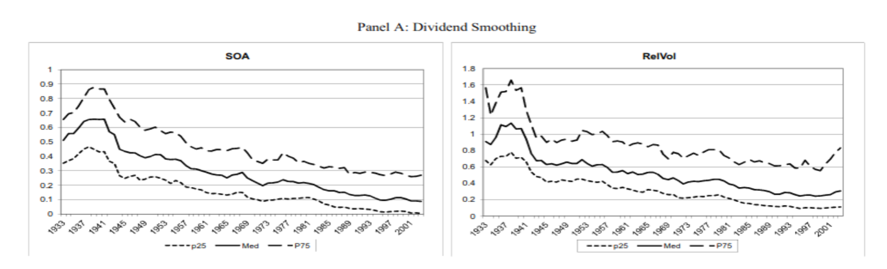
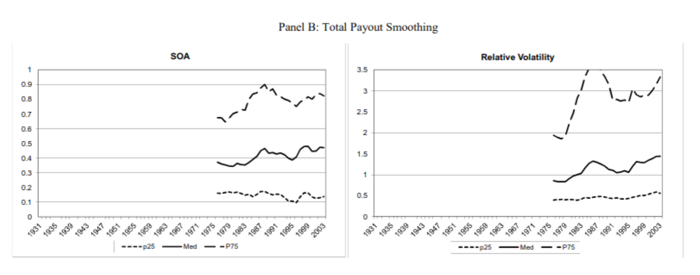

# Reading Note: Leary and Michaely (2011)

<a href="../01_Empirical_Corporate_Finance.html#sec-leary-michaely-2011">Back to the main note</a>

## 1. Core Question
This paper studies what drives dividend smoothing: which firm characteristics are associated with more or less smoothing, and how the cross-sectional patterns relate to signaling, agency frictions, and payout adjustment.

## 2. Main Channels
- information asymmetry
- signaling
- agency
- payout adjustment costs
- lifecycle / maturity

## 3. Reading Frame
- Dividend smoothing is not a single clean test of one theory.
- It is a reduced-form outcome of multiple payout frictions.
- Use this card to attach figures from the paper or lecture slides.

## 4. Figure Slots

## 5. Notes
- Add any regression tables, figures, or slide screenshots here.
- Keep the main note concise; use this card for visual evidence and annotations.
