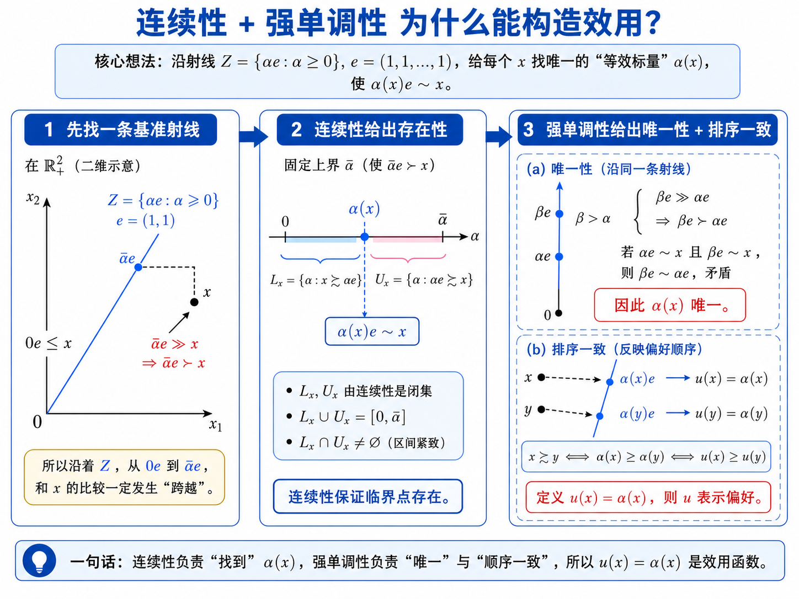
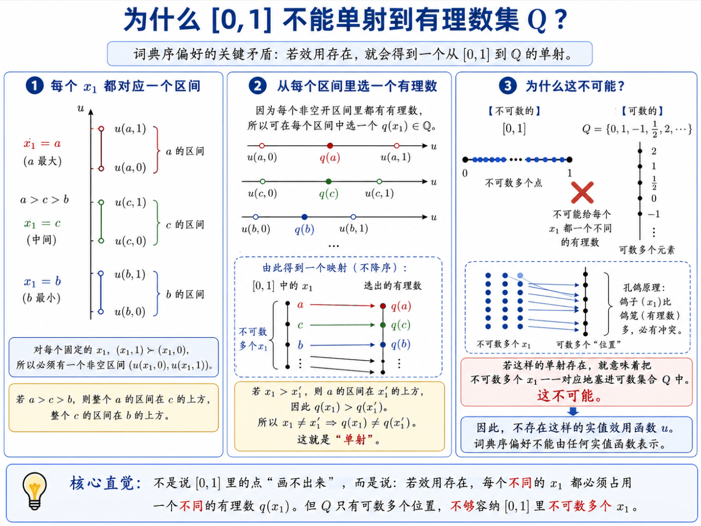
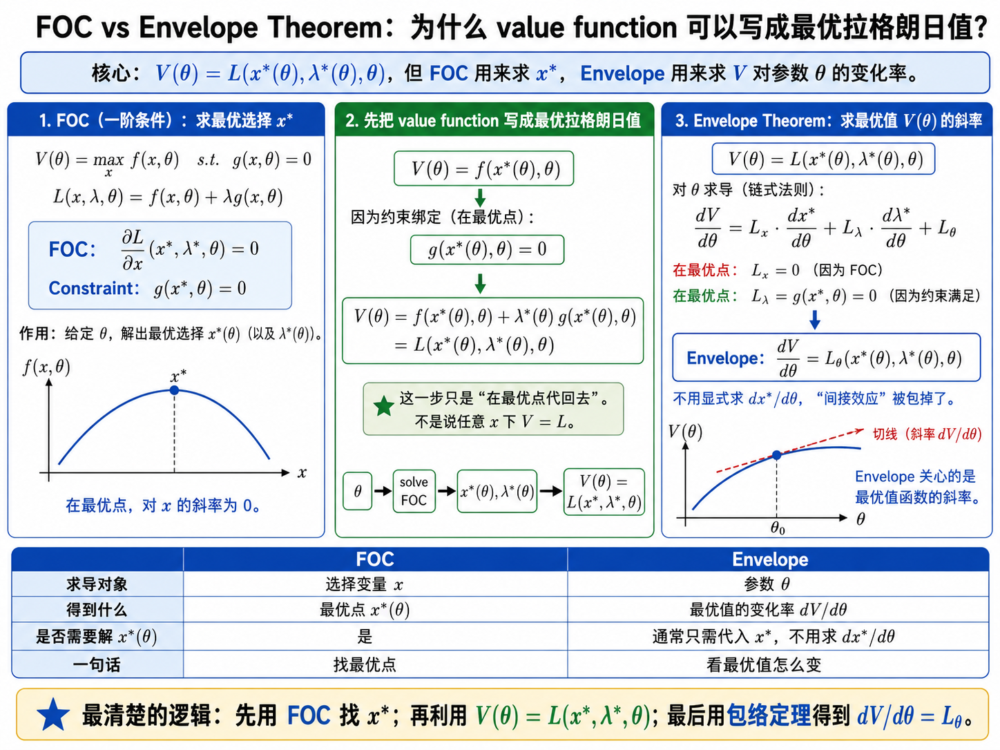
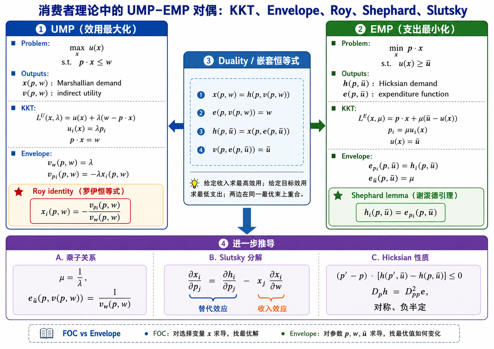
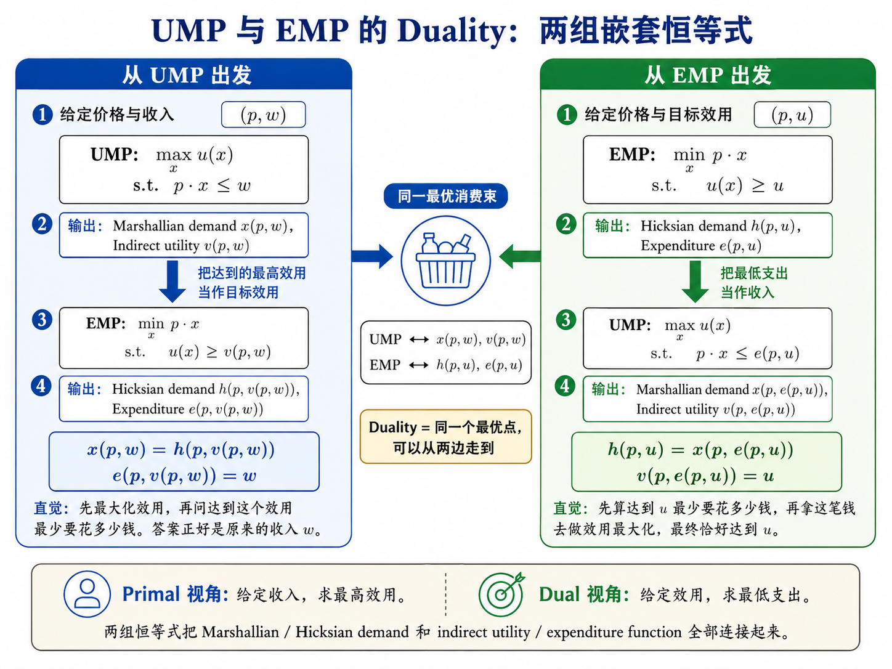

# 01 Static Choice, Consumer Demand, and Integrability

## 1. Static choice: primitives, preference, and revealed preference

:::{admonition} Definition (Choice structure)
A choice structure is $(\mathcal B,C(\cdot))$, where $\mathcal B$ is a family of feasible sets $B\subseteq X$, and $C(B)\subseteq B$, $C(B)\neq \varnothing$, is the set of alternatives chosen from $B$.
:::

:::{admonition} Definition (Preference relation)
A preference relation $\succeq$ on $X$ is a binary relation.

Strict preference and indifference are

$$
\begin{aligned}
x\succ y &\Longleftrightarrow x\succeq y\ \text{and not } y\succeq x,\\
x\sim y &\Longleftrightarrow x\succeq y\ \text{and }y\succeq x.
\end{aligned}
$$
:::

:::{admonition} Definition (Rational preference)
A preference relation is rational if it is complete and transitive:

$$
\begin{aligned}
\forall x,y\in X,\quad &x\succeq y \ \text{or}\ y\succeq x,\\
x\succeq y,\ y\succeq z \quad &\Longrightarrow\quad x\succeq z.
\end{aligned}
$$

:::

:::{admonition} Strict preference and indifference inherit transitivity
If $\succeq$ is rational, then $\succ$ and $\sim$ are transitive, and $x_1\sim x_2\succeq x_3\Rightarrow x_1\succeq x_3$.
:::

Proof:

1. Strict preference:

$$
\begin{aligned}
x\succ y,\ y\succ z
&\Longrightarrow x\succeq y,\ \neg(y\succeq x),\ y\succeq z,\ \neg(z\succeq y)\\
&\Longrightarrow x\succeq z.
\end{aligned}
$$

It remains to show $\neg(z\succeq x)$. Suppose instead $z\succeq x$. Then

$$
\begin{aligned}
z\succeq x,\ x\succeq y
&\Longrightarrow z\succeq y,
\end{aligned}
$$

contradicting $\neg(z\succeq y)$. Hence $x\succ z$.

2. Indifference:

$$
\begin{aligned}
x\sim y,\ y\sim z
&\Longrightarrow x\succeq y,\ y\succeq x,\ y\succeq z,\ z\succeq y\\
&\Longrightarrow x\succeq z,\ z\succeq x\\
&\Longrightarrow x\sim z.
\end{aligned}
$$

3. Mixed implication:

$$
\begin{aligned}
x_1\sim x_2,\ x_2\succeq x_3
&\Longrightarrow x_1\succeq x_2,\ x_2\succeq x_3\\
&\Longrightarrow x_1\succeq x_3.
\end{aligned}
$$

This is the clean QE proof style: expand the definitions first, then apply transitivity once.

:::{admonition} Definition (WARP)
Choice data $(\mathcal B,C)$ satisfy the Weak Axiom of Revealed Preference if whenever $x,y\in B$, $x\in C(B)$, then for every $B'\in \mathcal B$ with $x,y\in B'$, it is not the case that $y\in C(B')$ and $x\notin C(B')$.

:::

Intuition: once $x$ is chosen while $y$ is available, later $y$ cannot be chosen over $x$ when both are available.

:::{admonition} Fundamental theorem of revealed preference

Assume $\mathcal B$ is rich enough to include every subset of $X$ with at most three elements. Define the revealed preference relation

$$
\begin{aligned}
x\succeq^R y
\quad\Longleftrightarrow\quad
\exists B\in\mathcal B \text{ such that } x,y\in B \text{ and } x\in C(B).
\end{aligned}
$$

If $(\mathcal B,C)$ satisfies WARP, then $\succeq^R$ is rational and rationalizes the data.

We need to show

$$
\succeq^R\text{ complete},\qquad
\succeq^R\text{ transitive},\qquad
C(B)=C^*(B,\succeq^R).
$$
:::

Proof:

Completeness:

$$
\begin{aligned}
x,y\in X
&\Longrightarrow \{x,y\}\in\mathcal B\\
&\Longrightarrow C(\{x,y\})\neq\varnothing\\
&\Longrightarrow x\in C(\{x,y\})\ \text{or}\ y\in C(\{x,y\})\\
&\Longrightarrow x\succeq^R y\ \text{or}\ y\succeq^R x.
\end{aligned}
$$

Transitivity:

$$
\begin{aligned}
x\succeq^R y,\ y\succeq^R z
&\Longrightarrow x\in C(B_{xy}) \text{ for some }B_{xy}\ni x,y,\quad
y\in C(B_{yz}) \text{ for some }B_{yz}\ni y,z.
\end{aligned}
$$

Since $\{x,y,z\}\in\mathcal B$, WARP forces the choices on $\{x,y,z\}$ to be consistent with both revealed comparisons. In particular, if $z$ were chosen over $x$ from $\{x,y,z\}$, then either $x$'s revealed choice over $y$ or $y$'s revealed choice over $z$ would be violated. Thus $x\succeq^R z$.

Rationalization:

$$
\begin{aligned}
x\in C(B)
&\Longrightarrow \forall y\in B,\ x\succeq^R y\\
&\Longrightarrow x\in C^*(B,\succeq^R).
\end{aligned}
$$

Conversely, if $x\in C^*(B,\succeq^R)$ but $x\notin C(B)$, choose $y\in C(B)$. Then $y\succeq^R x$ by definition, while optimality of $x$ gives $x\succeq^R y$. WARP rules out $y$ being chosen when $x$ is available but $x$ not chosen, a contradiction. Therefore $C(B)=C^*(B,\succeq^R)$.

**H1 Q2 mini-template: WARP with $\{x,y\}$ and $\{x,y,z\}$**

Given $C(\{x,y\})=\{x\}$. If $y\in C(\{x,y,z\})$, then $y$ is chosen when $x$ is available while $x$ was chosen over $y$ in $\{x,y\}$, violating WARP unless $x$ is also chosen. Since $C(\{x,y\})=\{x\}$ excludes $y$, the safe conclusion is

$$
\begin{aligned}
C(\{x,y,z\})\subseteq \{x,z\},\qquad
C(\{x,y,z\})\neq\varnothing.
\end{aligned}
$$

So $C(\{x,y,z\})\in\{\{x\},\{z\},\{x,z\}\}$.

## 2. Utility representation

:::{admonition} Definition (Utility representation)
A utility function $u:X\to\mathbb R$ represents $\succeq$ if

$$
x\succeq y\quad\Longleftrightarrow\quad u(x)\ge u(y).
$$

:::

Utility representation is **ordinal** in consumer theory.

:::{admonition} Definition (Monotonicity and strong monotonicity)
For $x,y\in\mathbb R_+^n$:

$$
\begin{aligned}
x\ge y\ \text{componentwise},\ x\neq y
&\Longrightarrow x\succeq y
&&\text{(monotonicity)},\\
x\gg y
&\Longrightarrow x\succ y
&&\text{(strong monotonicity)}.
\end{aligned}
$$
Strong monotonicity says that if every commodity is strictly larger, the consumer strictly prefers the bundle.

:::

:::{admonition} Strictly increasing transformations preserve preferences
If $u$ represents $\succeq$ and $\phi:\mathbb R\to\mathbb R$ is strictly increasing, then $\phi\circ u$ represents $\succeq$.
:::

$$
\begin{aligned}
x\succeq y
&\Longleftrightarrow u(x)\ge u(y)\\
&\Longleftrightarrow \phi(u(x))\ge \phi(u(y))\\
&\Longleftrightarrow (\phi\circ u)(x)\ge(\phi\circ u)(y).
\end{aligned}
$$

If $\phi$ is only weakly increasing, strict rankings may collapse. Example: $\phi(t)=0$ for all $t$. Then all alternatives become indifferent, so $\phi\circ u$ cannot represent a nontrivial preference.

:::{admonition} Continuous monotone preferences imply utility representation on $\mathbb R_+^n$
The slides prove the simple monotone case using the ray $Z=\{\alpha e:\alpha\ge 0\}$, where $e=(1,\ldots,1)$.

For continuous and monotone $\succeq$, define $u(x)=\alpha(x)$, where $\alpha(x)e\sim x$, and show $u$ represents $\succeq$.
:::

Proof:

The proof has three steps.

1. Existence and uniqueness of $\alpha(x)$:

$$
\begin{aligned}
A^+(x)&:=\{\alpha\ge 0:\alpha e\succeq x\},\\
A^-(x)&:=\{\alpha\ge 0:x\succeq \alpha e\}.
\end{aligned}
$$

Continuity implies $A^+(x)$ and $A^-(x)$ are closed; monotonicity ensures both are nonempty after choosing a sufficiently large $\bar\alpha$ with $\bar\alpha e\gg x$. Completeness implies they cover the relevant interval. Therefore there exists $\alpha(x)$ such that

$$
\alpha(x)e\sim x.
$$

Monotonicity gives uniqueness.

2. Define

$$
u(x):=\alpha(x).
$$

3. Representation:

$$
\begin{aligned}
x\succeq y
&\Longleftrightarrow \alpha(x)e\succeq \alpha(y)e\\
&\Longleftrightarrow \alpha(x)\ge \alpha(y)\\
&\Longleftrightarrow u(x)\ge u(y).
\end{aligned}
$$

Important failure case: lexicographic preferences are rational but discontinuous; they do not admit a real-valued continuous utility representation.

## 3. Constrained optimization toolkit

The slides repeatedly use the equality-constrained program

$$
\begin{aligned}
\max_{x\in\mathbb R_+^n}\quad & f(x)\\
\text{s.t.}\quad & g_j(x)=0,\qquad j=1,\ldots,m.
\end{aligned}
$$

Define the Lagrangian

$$
\mathcal L(x,\lambda)
=
f(x)-\sum_{j=1}^m\lambda_jg_j(x).
$$

:::{admonition} Definition (Regularity condition / constraint qualification)
At an interior optimum $x^*$, the usual condition is that the constraint gradients $\nabla g_1(x^*),\ldots,\nabla g_m(x^*)$ are linearly independent, equivalently $m\le n$ and the constraint Jacobian has full row rank.

Intuition:

- If a direction $z$ has no first-order effect on every constraint, then
$\nabla g_j(x^*)\cdot z=0$ for all $j=1,\ldots,m$.
- Then it must also have no first-order effect on the objective, so
$\nabla f(x^*)\cdot z=0$.
- Hence $\nabla f(x^*)$ lies in the span of the linearly independent constraint gradients, which is why multipliers $\lambda_1,\ldots,\lambda_m$ exist.

:::

At an interior optimum $x^*$, under this regularity condition,

$$
\begin{aligned}
\nabla_x f(x^*)-\sum_{j=1}^m\lambda_j\nabla_x g_j(x^*)&=0,\qquad
g_j(x^*)&=0,\quad j=1,\ldots,m.
\end{aligned}
$$

### Envelope theorem

:::{admonition} Theorem 15 (Envelope theorem)
Assume the value function

$$
\begin{aligned}
v(\theta)
=
\max_x\quad & f(x,\theta)\\
\text{s.t.}\quad & g_j(x,\theta)=0,\qquad j=1,\ldots,m,
\end{aligned}
$$

is differentiable at $\bar\theta$, and let $(\lambda_1,\ldots,\lambda_m)$ be the Lagrange multipliers associated with the solution $x(\bar\theta)$. If

$$
\mathcal L(x,\lambda,\theta)
=
f(x,\theta)-\sum_{j=1}^m \lambda_j g_j(x,\theta),
$$

then

$$
\begin{aligned}
\frac{dv(\bar\theta)}{d\theta_k}
&=
\frac{\partial \mathcal L(x(\bar\theta),\lambda,\bar\theta)}{\partial \theta_k}\\
&=
\frac{\partial f(x(\bar\theta),\bar\theta)}{\partial \theta_k}
-\sum_{j=1}^m \lambda_j \frac{\partial g_j(x(\bar\theta),\bar\theta)}{\partial \theta_k},
\qquad k=1,\ldots,s.
\end{aligned}
$$
:::

Proof sketch:

$$
\begin{aligned}
v(\theta)&=f(x(\theta),\theta),\\
\frac{dv(\theta)}{d\theta_k}
&=
\frac{\partial f(x(\theta),\theta)}{\partial \theta_k}
+\sum_{i=1}^n \frac{\partial f(x(\theta),\theta)}{\partial x_i}\frac{\partial x_i(\theta)}{\partial \theta_k},\\
\frac{\partial f(x(\theta),\theta)}{\partial x_i}
&=
\sum_{j=1}^m \lambda_j \frac{\partial g_j(x(\theta),\theta)}{\partial x_i},\\
\Rightarrow\quad
\frac{dv(\theta)}{d\theta_k}
&=
\frac{\partial f(x(\theta),\theta)}{\partial \theta_k}
+\sum_{j=1}^m \lambda_j \sum_{i=1}^n \frac{\partial g_j(x(\theta),\theta)}{\partial x_i}\frac{\partial x_i(\theta)}{\partial \theta_k},\\
&=
\frac{\partial f(x(\theta),\theta)}{\partial \theta_k}
-\sum_{j=1}^m \lambda_j \frac{\partial g_j(x(\theta),\theta)}{\partial \theta_k}.
\end{aligned}
$$

The indirect utility function and expenditure function are value functions, so Roy's identity and Shephard's lemma are envelope-theorem applications.

## 4. Consumer problem: Marshallian demand and indirect utility

:::{admonition} Definition (Consumer problem)
Given prices $p\gg 0$, wealth $w>0$, and utility $u$, the consumer problem is

$$
\begin{aligned}
\max_{x\in\mathbb R_+^n}\quad &u(x)\\
\text{s.t.}\quad &p\cdot x\le w.
\end{aligned}
$$
The solution $x(p,w)$ is Marshallian demand, and

$$
v(p,w):=u(x(p,w))
$$
is indirect utility.

:::

Under strong monotonicity, the budget binds:

$$
p\cdot x(p,w)=w.
$$

For an interior solution, the Lagrangian is

$$
\mathcal L(x,\lambda)=u(x)-\lambda(p\cdot x-w).
$$

FOCs:

$$
\begin{aligned}
u_i(x^*)&=\lambda p_i,\qquad i=1,\ldots,n,\\
p\cdot x^*&=w.
\end{aligned}
$$

Thus for any $i,j$,

$$
\frac{u_i(x^*)}{u_j(x^*)}=\frac{p_i}{p_j}.
$$

Interpretation: the marginal rate of substitution equals the price ratio.

:::{admonition} Cobb-Douglas Marshallian demand
For $u(x_1,x_2)=x_1^\alpha x_2^\beta$ with $\alpha,\beta>0$, derive $x_1(p,w)$, $x_2(p,w)$, and $v(p,w)$.
:::

Proof:

FOCs:

$$
\begin{aligned}
\alpha x_1^{\alpha-1}x_2^\beta&=\lambda p_1,\\
\beta x_1^\alpha x_2^{\beta-1}&=\lambda p_2,\\
p_1x_1+p_2x_2&=w.
\end{aligned}
$$

Divide the first FOC by the second:

$$
\begin{aligned}
\frac{\alpha x_1^{\alpha-1}x_2^\beta}{\beta x_1^\alpha x_2^{\beta-1}}
&=\frac{p_1}{p_2}\\
\frac{\alpha}{\beta}\frac{x_2}{x_1}
&=\frac{p_1}{p_2}\\
p_1x_1&=\frac{\alpha}{\beta}p_2x_2.
\end{aligned}
$$

Use the budget:

$$
\begin{aligned}
p_1x_1+p_2x_2&=w,\\
\frac{\alpha}{\beta}p_2x_2+p_2x_2&=w,\\
p_2x_2\frac{\alpha+\beta}{\beta}&=w,\\
x_2^*(p,w)&=\frac{\beta}{\alpha+\beta}\frac{w}{p_2}.
\end{aligned}
$$

Then

$$
x_1^*(p,w)=\frac{\alpha}{\alpha+\beta}\frac{w}{p_1}.
$$

Indirect utility:

$$
\begin{aligned}
v(p,w)
&=
\left(\frac{\alpha}{\alpha+\beta}\frac{w}{p_1}\right)^\alpha
\left(\frac{\beta}{\alpha+\beta}\frac{w}{p_2}\right)^\beta.
\end{aligned}
$$

Both goods are normal because

$$
\frac{\partial x_1}{\partial w}>0,\qquad
\frac{\partial x_2}{\partial w}>0.
$$
:::

## 5. Expenditure minimization, Hicksian demand, and expenditure function

:::{admonition} Definition (Expenditure minimization problem)
Given $p\gg 0$ and target utility $\bar u$, the expenditure minimization problem is

$$
\begin{aligned}
\min_{x\in\mathbb R_+^n}\quad &p\cdot x\\
\text{s.t.}\quad &u(x)\ge \bar u.
\end{aligned}
$$
The solution $h(p,\bar u)$ is Hicksian demand, and

$$
e(p,\bar u):=p\cdot h(p,\bar u)
$$
is the expenditure function.

:::

For the same Cobb-Douglas $u=x_1^\alpha x_2^\beta$, the EMP FOCs are

$$
\begin{aligned}
p_1&=\lambda \alpha x_1^{\alpha-1}x_2^\beta,\\
p_2&=\lambda \beta x_1^\alpha x_2^{\beta-1},\\
x_1^\alpha x_2^\beta&=\bar u.
\end{aligned}
$$

The ratio gives

$$
\begin{aligned}
\frac{p_1}{p_2}
&=\frac{\alpha}{\beta}\frac{x_2}{x_1}\\
x_2&=\frac{\beta p_1}{\alpha p_2}x_1.
\end{aligned}
$$

Substitute into the utility constraint:

$$
\begin{aligned}
x_1^\alpha
\left(\frac{\beta p_1}{\alpha p_2}x_1\right)^\beta
&=\bar u\\
x_1^{\alpha+\beta}
&=
\bar u\left(\frac{\alpha p_2}{\beta p_1}\right)^\beta\\
h_1(p,\bar u)
&=
\bar u^{1/(\alpha+\beta)}
\left(\frac{\alpha p_2}{\beta p_1}\right)^{\beta/(\alpha+\beta)}.
\end{aligned}
$$

Similarly,

$$
h_2(p,\bar u)
=
\bar u^{1/(\alpha+\beta)}
\left(\frac{\beta p_1}{\alpha p_2}\right)^{\alpha/(\alpha+\beta)}.
$$

Cost function:

$$
\begin{aligned}
e(p,\bar u)
&=p_1h_1(p,\bar u)+p_2h_2(p,\bar u)\\
&=(\alpha+\beta)
\left(
\frac{\bar u\,p_1^\alpha p_2^\beta}{\alpha^\alpha\beta^\beta}
\right)^{1/(\alpha+\beta)}.
\end{aligned}
$$

When $\alpha+\beta=1$, this simplifies to

$$
e(p,\bar u)=
\frac{p_1^\alpha p_2^\beta}{\alpha^\alpha\beta^\beta}\bar u.
$$

## 6. Duality: Roy, Shephard, and identities

:::{admonition} Roy's identity
For Marshallian demand,

$$
x_i(p,w)=-\frac{v_{p_i}(p,w)}{v_w(p,w)}.
$$
:::

Proof:

$$
\begin{aligned}
v(p,w)&=u(x(p,w)),\\
\mathcal L^U(x,\lambda,p,w)&=u(x)+\lambda(w-p\cdot x).
\end{aligned}
$$

By the envelope theorem,

$$
\begin{aligned}
v_w(p,w)&=\frac{\partial \mathcal L^U}{\partial w}=\lambda,\\
v_{p_i}(p,w)&=\frac{\partial \mathcal L^U}{\partial p_i}=-\lambda x_i(p,w).
\end{aligned}
$$

Therefore

$$
\begin{aligned}
x_i(p,w)=-\frac{v_{p_i}(p,w)}{v_w(p,w)}.
\end{aligned}
$$

:::{admonition} Shephard's lemma
For Hicksian demand,

$$
\frac{\partial e(p,\bar u)}{\partial p_i}=h_i(p,\bar u).
$$
:::

Proof:

$$
\begin{aligned}
e(p,\bar u)&=p\cdot h(p,\bar u),\\
\mathcal L^E(x,\mu,p,\bar u)&=p\cdot x+\mu(\bar u-u(x)).
\end{aligned}
$$

By the envelope theorem,

$$
\begin{aligned}
e_{p_i}(p,\bar u)&=\frac{\partial \mathcal L^E}{\partial p_i}=h_i(p,\bar u),\\
e_{\bar u}(p,\bar u)&=\frac{\partial \mathcal L^E}{\partial \bar u}=\mu.
\end{aligned}
$$

Therefore

$$
\begin{aligned}
\frac{\partial e(p,\bar u)}{\partial p_i}=h_i(p,\bar u).
\end{aligned}
$$

:::{admonition} Dual equalities
At corresponding utility/income levels,

$$
\begin{aligned}
v(p,e(p,\bar u))&=\bar u,\\
e(p,v(p,w))&=w,\\
h(p,v(p,w))&=x(p,w),\\
x(p,e(p,\bar u))&=h(p,\bar u).
\end{aligned}
$$
:::

Proof:

$$
\begin{aligned}
&u(h(p,\bar u))=\bar u,\qquad p\cdot h(p,\bar u)=e(p,\bar u),\\
&u(x(p,w))=v(p,w),\qquad p\cdot x(p,w)=w.
\end{aligned}
$$

If $\bar u=v(p,w)$, then $x(p,w)$ is feasible for EMP and achieves expenditure $w$, so $e(p,v(p,w))\le w$. If $e(p,v(p,w))<w$, a bundle with the same utility and lower expenditure would contradict minimality, hence $e(p,v(p,w))=w$. Symmetrically, if $w=e(p,\bar u)$, then $h(p,\bar u)$ is feasible for UMP and achieves utility $\bar u$, so $v(p,e(p,\bar u))=\bar u$. Under uniqueness, the optimizers coincide, hence $h(p,v(p,w))=x(p,w)$ and $x(p,e(p,\bar u))=h(p,\bar u)$.

:::{admonition} Law of demand
For every $p,p'\gg 0$ and every $u$,

$$
(p'-p)\cdot\big(h(p',u)-h(p,u)\big)\le 0.
$$

If $p$ and $p'$ only differ in the price of good $i$, then

$$
(p_i'-p_i)\big(h_i(p',u)-h_i(p,u)\big)\le 0.
$$
:::

Proof:

$$
\begin{aligned}
e(p',u)&=p'\cdot h(p',u)\le p'\cdot h(p,u),\\
e(p,u)&=p\cdot h(p,u)\le p\cdot h(p',u).
\end{aligned}
$$

Subtracting gives

$$
\begin{aligned}
0\le (p'-p)\cdot\big(h(p,u)-h(p',u)\big),
\end{aligned}
$$

which is equivalent to the stated inequality.

### Comparative statics

$$
\begin{aligned}
\text{(CP)}\quad &x(p,w),\,v(p,w)\ \text{vary with }p,w,\\
\text{(EMP)}\quad &h(p,u),\,e(p,u)\ \text{vary with }p,u.
\end{aligned}
$$

The law of demand is the clean comparative-static statement on the EMP side.
:::

## 7. Demand restrictions and Slutsky matrix

:::{admonition} Property summary

$$
\begin{array}{c|c|c}
\text{问题} & \text{缩放什么} & \text{结论}\\
\hline
\text{UMP} & (p,w)\mapsto (\lambda p,\lambda w) & x(\lambda p,\lambda w)=x(p,w)\\
\text{UMP值函数} & (p,w)\mapsto (\lambda p,\lambda w) & v(\lambda p,\lambda w)=v(p,w)\\
\text{EMP} & p\mapsto \lambda p & h(\lambda p,\bar u)=h(p,\bar u)\\
\text{EMP值函数} & p\mapsto \lambda p & e(\lambda p,\bar u)=\lambda e(p,\bar u)
\end{array}
$$
:::

Marshallian demand satisfies:

$$
\begin{aligned}
x(\lambda p,\lambda w)&=x(p,w),\qquad \lambda>0,\\
p\cdot x(p,w)&=w.
\end{aligned}
$$

Hicksian demand satisfies:

$$
h(\lambda p,\bar u)=h(p,\bar u),\qquad \lambda>0.
$$

Expenditure satisfies:

$$
e(\lambda p,\bar u)=\lambda e(p,\bar u).
$$

The Slutsky matrix is

$$
S(p,w)=\{s_{ij}\}_{i,j=1}^n,\qquad
s_{ij}:=
\frac{\partial x_i(p,w)}{\partial p_j}
+
\frac{\partial x_i(p,w)}{\partial w}x_j(p,w).
$$

Slutsky equation:

$$
\begin{aligned}
s_{ij}
=
\frac{\partial h_i(p,u)}{\partial p_j}
\bigg|_{u=v(p,w)}.
\end{aligned}
$$

### Symmetry

Using Shephard's lemma,

$$
\begin{aligned}
s_{ij}
&=\frac{\partial h_i(p,u)}{\partial p_j}\\
&=\frac{\partial}{\partial p_j}\frac{\partial e(p,u)}{\partial p_i}\\
&=\frac{\partial^2 e(p,u)}{\partial p_j\partial p_i}\\
&=\frac{\partial^2 e(p,u)}{\partial p_i\partial p_j}\\
&=s_{ji}.
\end{aligned}
$$

:::{admonition} Negative semidefiniteness
For any $z\in\mathbb R^n$,

$$
z^\top S z\le 0.
$$
:::

Proof:
It is enough to show $e(p,u)$ is concave in $p$. Fix $p,p'$, $\alpha\in[0,1]$, and set $p''=\alpha p+(1-\alpha)p'$. Since $h(p'',u)$ attains at least utility $u$,

$$
\begin{aligned}
p\cdot h(p'',u)&\ge e(p,u),\\
p'\cdot h(p'',u)&\ge e(p',u).
\end{aligned}
$$

Then

$$
\begin{aligned}
e(p'',u)
&=p''\cdot h(p'',u)\\
&=[\alpha p+(1-\alpha)p']\cdot h(p'',u)\\
&=\alpha p\cdot h(p'',u)+(1-\alpha)p'\cdot h(p'',u)\\
&\ge \alpha e(p,u)+(1-\alpha)e(p',u).
\end{aligned}
$$

This is the concavity inequality. Therefore the Hessian $\nabla^2_{pp}e(p,u)$ is negative semidefinite, and since $S=\nabla^2_{pp}e$, the Slutsky matrix is negative semidefinite.

## 8. Integrability theorem

:::{admonition} Integrability theorem
A Marshallian demand $x(p,w)$ is rationalizable by utility maximization if and only if it satisfies:

$$
\begin{aligned}
x(\lambda p,\lambda w)&=x(p,w),\qquad \lambda>0,\\
p\cdot x(p,w)&=w,\\
S(p,w)&=S(p,w)^\top,\qquad z^\top S(p,w)z\le 0\quad \forall z.
\end{aligned}
$$
:::

Proof sketch:
The restrictions are the standard necessities collected from the earlier sections: homogeneity and Walras' law follow from the consumer problem, while symmetry and negative semidefiniteness come from Shephard's lemma and the concavity of the expenditure function. Together they characterize rationalizable demand under the regularity conditions stated above.

Exam interpretation: empirical demand systems should be checked against these restrictions. Homogeneity and Walras' law are accounting/scale restrictions; Slutsky symmetry and negative semidefiniteness encode optimizing behavior.
